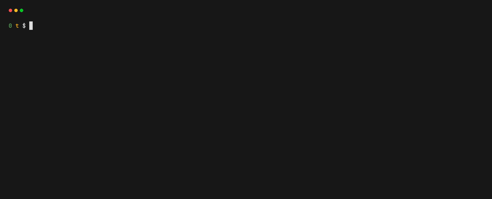

# t

Manage your todo lists in the CLI.

<p align="center">
  
</p>

## Getting started

### Installation and usage

#### macOS

```bash
brew tap unfunco/tap
brew install t
```

Add an item to the general todo list:

```bash
t "Do something"
```

Add an item to today's todo list:

```bash
t "Do something today" --today
```

Add an item to tomorrow's todo list:

```bash
t "Do something tomorrow" --tomorrow
```

Open the TUI:

```bash
t
```

### Configuration

Themes can now adapt to both light and dark terminals. By default `t` uses
`mode: "auto"` and switches palettes based on the detected background colour.
You can force either palette or customise the colours by editing `config.json`
in your config directory (typically `~/.config/t/config.json`):

```json
{
  "theme": {
    "mode": "auto",
    "dark": {
      "text": "#FFFFFF",
      "muted": "#696969",
      "highlight": "#58C5C7",
      "success": "#99CC00",
      "worry": "#FF7676"
    },
    "light": {
      "text": "#121417",
      "muted": "#61646B",
      "highlight": "#205CBE",
      "success": "#007A3B",
      "worry": "#C62828"
    }
  }
}
```

Set `"mode": "dark"` or `"mode": "light"` to lock the palette regardless of
background detection.

### Development and testing

#### Requirements

- [Go] 1.25+

Clone the repository and navigate to the `t` directory.

```bash
git clone git@github.com:unfunco/t.git
cd t
```

```bash
go build
```

Play with some test data:

```bash
mkdir testdata/t
cp testdata/*.json testdata/t/
XDG_DATA_HOME="$PWD/testdata" XDG_CONFIG_HOME="$PWD/testdata" ./t
```

#### Generate the demo gif

```bash
cp testdata/*.json testdata/t
PATH="$PWD:$PATH" vhs demo.tape
```

## License

© 2025 [Daniel Morris]\
Made available under the terms of the [MIT License].

[daniel morris]: https://unfun.co
[go]: https://go.dev
[mit license]: LICENSE.md
